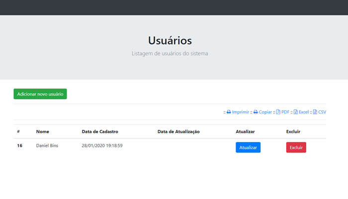

# MONTARSITE

Avaliação de PHP da agência MontarSite. Feito com PHP puro, Bootstrap, PDO e banco de dados MySQL.

## Instalação

- git clone https://github.com/dbins/montarsite
- Crie um banco de dados chamado montarsite
- Altere o arquivo lib/conexao.php e adicione as credenciais de acesso (endereço, login e senha)
- Subir para um servidor PHP
- O login e a senha são fixos (login: MONTAR, senha: SITE)

## Especificações

- Backend deve ser desenvolvido em PHP e MySQL, puro ou com framework, como preferir.
- Frontend deve utilizar biblioteca Bootstrap para prover uma formatação mínima da página e dos controles.
- Layout não precisa ser trabalhado, apenas é necessário preservar uma estética mínima: elementos não devem estar grudados sem margem, página deve estar centralizada, textos e elementos não podem estar vazando para fora (overflowing) das suas áreas.
- Utilizar tabela no banco de dados com campos para a) ID (primary key), b) nome completo, e c) última atualização.

## Requisitos Funcionais

- Desenvolver uma interface aonde as entradas existentes são listadas com informação de todas as colunas.
- Incluir uma forma de adicionar nova entrada, digitando apenas o nome. O ID e última atualização são preenchidos pelo sistema.
- Incluir uma validação, tanto em Javascript quanto em PHP, verificando se o nome a) foi preenchido, e b) contém no mínimo um nome e sobrenome.
- Incluir uma forma de modificar o nome de uma entrada existente.
- Incluir uma forma de excluir uma entrada.